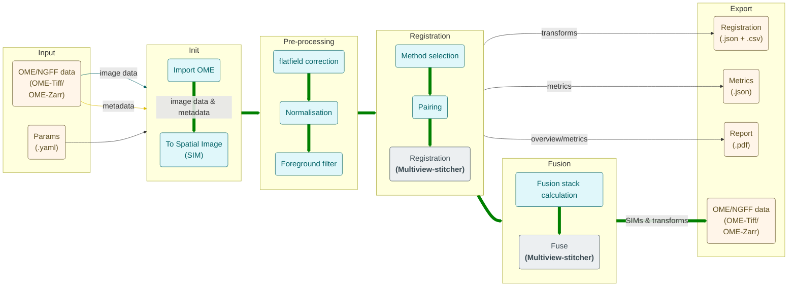
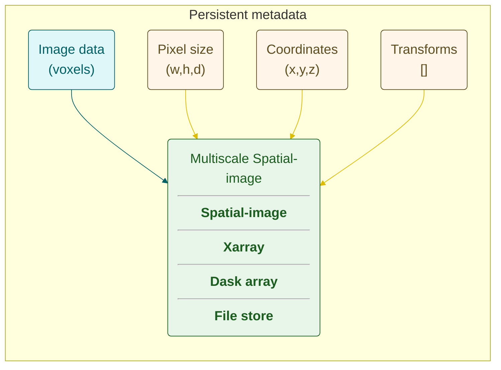

# muvis-align: building a registration pipeline for large data & next gen file format

## Joost de Folter (Francis Crick Institute, London), Marvin Albert (ETH, Zurich)

We present a new registration pipeline called **muvis-align**, which is based on the **multiview-stitcher** toolbox. Multiview-stitcher is an open-source modular toolbox developed for distributed and tiled stitching of 2-3D data. This modular, powerful toolbox is used to develop a flexible registration pipeline including pre- and post-processing steps as well as custom functions allowing x-y stitching and z reconstruction, for different image modalities. Importantly muvis-align overcomes limitations in existing tools used commonly, in particular handling large datasets (TBs) and fully supports the **Next Generation File Format** **Ome-zarr**. Preliminary registration tests show results of various LM and EM datasets equal or better compared to existing tools using affine transformations. This tool is further being developed with a napari user interface allowing easy configuration, exploring responsive dynamic configuration and providing visual feedback on preliminary and final results.

[github.com/FrancisCrickInstitute/muvis-align](https://github.com/FrancisCrickInstitute/muvis-align)

[github.com/multiview-stitcher/multiview-stitcher](https://github.com/multiview-stitcher/multiview-stitcher)

## FAIR
* **F**indable: Searchable good metadata
* **A**ccessible: Online & open
* **I**nteroperable: Compatible format
* **R**eusable: Record method

**General**: Unambiguously descriptive, follow standards, persistent

**FAIR 2.0**: Use standard vocabularies, include level of confidence

FAST-EM array tomography (EMPIAR 12193)

**CCP-volumeEM**: Martin Jones, Lucy Collinson, Michele Darrow, Matthew Hartley, Leandro Lemgruber, Helen Spiers, Amy Strange, Paul Verkade, Martyn Winn
